# Баг-репорт по заданию "Поиск и приоритезация багов на скриншотах" (Task 1)

## Описание задания
Найдите баги на приложенных скриншотах (`edit-form.png`, `item-card.png`, `seller-card.png`), приоритезируйте их и опишите.
- **P0** — критический (блокер основного сценария, критическое искажение финансовых данных).
- **P1** — высокий (существенные расхождения данных товара, недоступность ключевой функциональности).
- **P2** — средний (второстепенные характеристики, некритичные UI/текстовые дефекты).
- **P3** — низкий (косметические версточные баги, битые иконки, дублирование названий).

**Источник истины (Ожидаемый результат)**: Скриншот «Форма редактирования» (`edit-form.png`).

---

## Сводная таблица найденных дефектов

| ID | Приоритет | Компонент / Скриншот | Название бага |
|---|---|---|---|
| BUG-01 | **P0** | Карточка товара (`item-card.png`) | Завышена цена товара (52 000 ₽ вместо 25 000 руб.) |
| BUG-02 | **P0** | Карточка товара (`item-card.png`) | Недоступна Авито Доставка для покупателя при включенной доставке у продавца |
| BUG-03 | **P0** | Кабинет продавца (`seller-card.png`) / Карточка товара | Конфликт статуса модерации: объявление «На проверке» доступно покупателям |
| BUG-04 | **P1** | Кабинет продавца (`seller-card.png`) | Некорректный заголовок товара («Диван прямой...» вместо «Диван угловой модульный...») |
| BUG-05 | **P1** | Карточка товара (`item-card.png`) | Искажение состояния обивки («Требует замены» вместо «Всё в порядке») |
| BUG-06 | **P1** | Карточка товара (`item-card.png`) | Искажение состояния механизма («Требуется ремонт» вместо «Всё в порядке») |
| BUG-07 | **P1** | Карточка товара (`item-card.png`) | Искажение состояния каркаса («Требуется ремонт» вместо «Всё в порядке») |
| BUG-08 | **P1** | Карточка товара (`item-card.png`) | Некорректное значение формы дивана («Прямой» вместо «Угловой») |
| BUG-09 | **P1** | Карточка товара (`item-card.png`) | Сброшен признак «Модульный» («Нет» вместо «Да») |
| BUG-10 | **P1** | Карточка товара (`item-card.png`) | Ложный признак отсутствия спального места («Нет» вместо «Есть») |
| BUG-11 | **P1** | Карточка товара (`item-card.png`) | Ложный признак отсутствия раскладного механизма («Нет» вместо «Есть») |
| BUG-12 | **P1** | Карточка товара (`item-card.png`) | Перепутаны параметры габаритов «Высота» (95 см) и «Глубина» (85 см) |
| BUG-13 | **P1** | Карточка товара (`item-card.png`) | Неверное количество товара в наличии (3 шт. вместо 1 шт.) |
| BUG-14 | **P1** | Карточка товара (`item-card.png`) | Ошибка в номере дома в адресе (пл. Революции, 5 вместо пл. Революции, 3) |
| BUG-15 | **P2** | Карточка товара / Кабинет продавца | Лишний сгенерированный текст в описании товара |
| BUG-16 | **P2** | Карточка товара / Кабинет продавца | Некорректный состав поля «Особенности» (добавлены невыбранные опции) |
| BUG-17 | **P2** | Кабинет продавца (`seller-card.png`) | Отображение технического слага `test_sale_ops` в блоке промо-акций |
| BUG-18 | **P3** | Форма редактирования (`edit-form.png`) | Задвоение заголовка секции «Внешний вид» |
| BUG-19 | **P3** | Кабинет продавца (`seller-card.png`) | Битое изображение иконки акции в блоке продвижения |
| BUG-20 | **P3** | Карточка товара (`item-card.png`) | Дублирование элементов шапки (header) в самом низу страницы под футтером |
| BUG-21 | **P3** | Кабинет продавца (`seller-card.png`) | Дублирование элементов шапки (header) в самом низу страницы под футтером |
| BUG-22 | **P3** | Карточка товара (`item-card.png`) | Регистр строки статуса («Опубликовано · в наличии 3 шт.» — строчная «в» против заглавной в блоке характеристик) |

---

## Детальное описание багов

### P0 — Критические баги (Critical)

#### BUG-01: Некорректная цена товара на публичной карточке
- **Где обнаружено**: `item-card.png` (Блок цены вверху справа)
- **Фактический результат**: Отображается цена **52 000 ₽**.
- **Ожидаемый результат**: Должна отображаться цена **25 000 руб.** (как в `edit-form.png` и `seller-card.png`).
- **Влияние**: Покупателю показывается некорректная цена (перепутаны цифры 25 -> 52), что блокирует продажи и вводит клиентов в заблуждение.
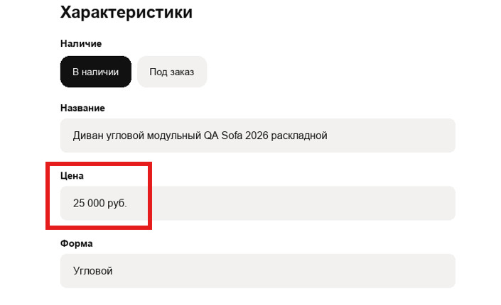

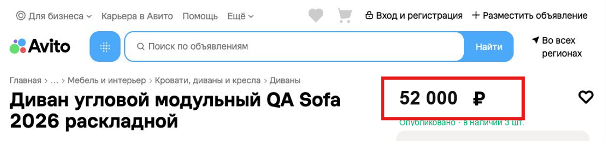

#### BUG-02: Недоступность Авито Доставки для покупателя при включенной услуге у продавца
- **Где обнаружено**: `item-card.png` (Блок доставки под ценой)
- **Фактический результат**: Отображается плашка «Доставка недоступна. Продавец отключил доставку для объявления».
- **Ожидаемый результат**: Авито Доставка должна быть доступна для заказа, так как в `edit-form.png` выбрано «Авито Доставка: Включена (Выбраны 2 способа отправки)» и в `seller-card.png` переключатель «Партнёрами Авито» включен.
- **Влияние**: Покупатель не может оформить покупку товара с доставкой.

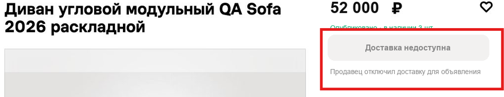

#### BUG-03: Рассогласование статуса публикации и доступности объявления покупателям
- **Где обнаружено**: `seller-card.png` vs `item-card.png`
- **Фактический результат**: В кабинете продавца у объявления статус «На проверке», однако публичная карточка товара уже опубликована и доступна по прямой ссылке / из поиска («Опубликовано»).
- **Ожидаемый результат**: Объявление на этапе модерации («На проверке») не должно быть доступно покупателям до успешного завершения проверки.

---

### P1 — Высокий приоритет (High)

#### BUG-04: Некорректное наименование товара в кабинете продавца
- **Где обнаружено**: `seller-card.png` (Главный заголовок h1)
- **Фактический результат**: Заголовок объявления: `Диван прямой QA Sofa 2026 раскладной`.
- **Ожидаемый результат**: Заголовок должен быть `Диван угловой модульный QA Sofa 2026 раскладной` (согласно `edit-form.png`).

#### BUG-05: Искажение состояния обивки товара в карточке покупателя
- **Где обнаружено**: `item-card.png` (Раздел «О диване»)
- **Фактический результат**: `Состояние обивки: Требует замены`.
- **Ожидаемый результат**: `Состояние обивки: Всё в порядке` (в `edit-form.png` выбрано «Всё в порядке»).

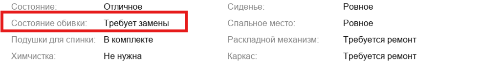

#### BUG-06: Искажение состояния раскладного механизма в карточке покупателя
- **Где обнаружено**: `item-card.png` (Раздел «О диване»)
- **Фактический результат**: `Раскладной механизм: Требуется ремонт`.
- **Ожидаемый результат**: `Раскладной механизм: Всё в порядке` (в `edit-form.png` выбрано «Всё в порядке»).

#### BUG-07: Искажение состояния каркаса товара в карточке покупателя
- **Где обнаружено**: `item-card.png` (Раздел «О диване»)
- **Фактический результат**: `Каркас: Требуется ремонт`.
- **Ожидаемый результат**: `Каркас: Всё в порядке` (в `edit-form.png` выбрано «Всё в порядке»).

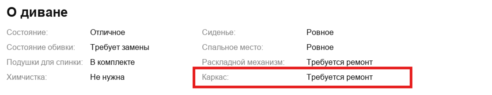

#### BUG-08: Некорректное значение характеристики «Форма» на карточке товара
- **Где обнаружено**: `item-card.png` (Раздел «Характеристики»)
- **Фактический результат**: `Форма: Прямой`.
- **Ожидаемый результат**: `Форма: Угловой` (в `edit-form.png` выбрано «Угловой»).

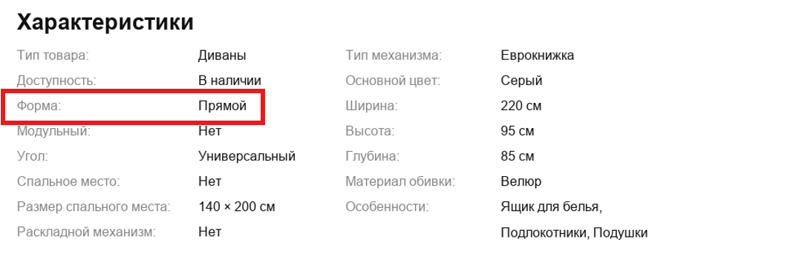

#### BUG-09: Искажение характеристики «Модульный» на карточке товара
- **Где обнаружено**: `item-card.png` (Раздел «Характеристики»)
- **Фактический результат**: `Модульный: Нет`.
- **Ожидаемый результат**: `Модульный: Да` (в `edit-form.png` выбрана опция «Да»).

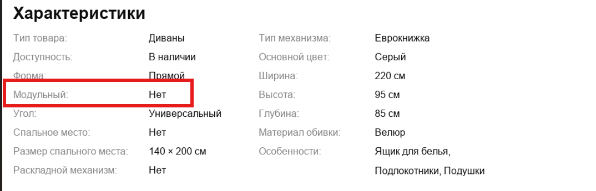

#### BUG-10: Ложный признак отсутствия спального места на карточке товара
- **Где обнаружено**: `item-card.png` (Раздел «Характеристики»)
- **Фактический результат**: `Спальное место: Нет` (при этом ниже указан размер спального места `140 × 200 см` — логическое противоречие).
- **Ожидаемый результат**: `Спальное место: Есть` (в `edit-form.png` выбрана опция «Есть»).

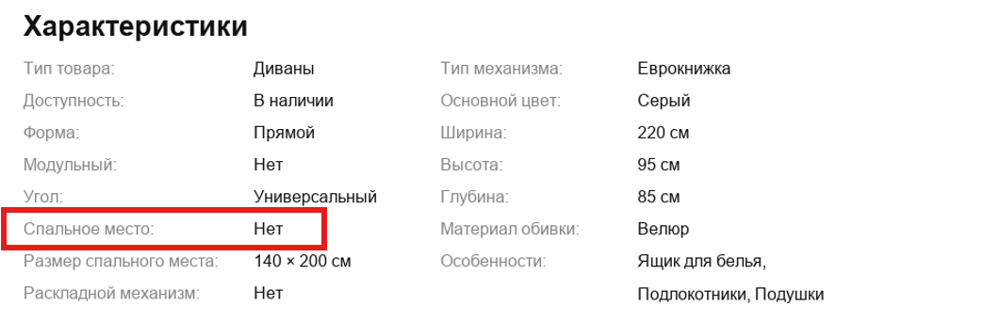

#### BUG-11: Ложный признак отсутствия раскладного механизма на карточке товара
- **Где обнаружено**: `item-card.png` (Раздел «Характеристики»)
- **Фактический результат**: `Раскладной механизм: Нет` (при этом указан тип механизма `Еврокнижка` — логическое противоречие).
- **Ожидаемый результат**: `Раскладной механизм: Есть` (в `edit-form.png` выбрана опция «Есть»).
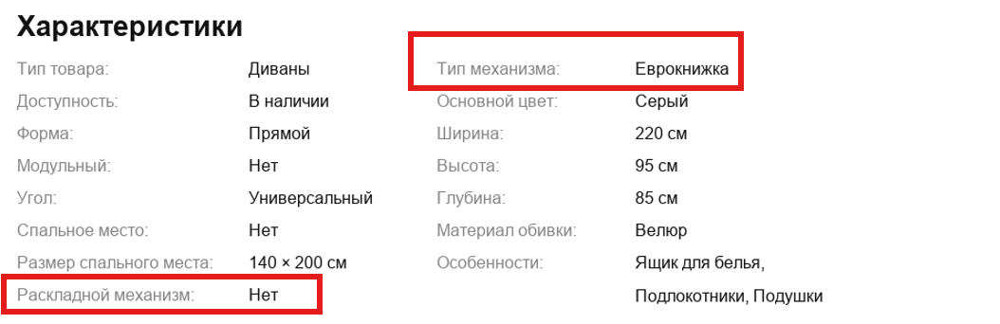

#### BUG-12: Перепутаны параметры габаритов «Высота» и «Глубина» на карточке товара
- **Где обнаружено**: `item-card.png` (Раздел «Характеристики»)
- **Фактический результат**: `Высота: 95 см`, `Глубина: 85 см`.
- **Ожидаемый результат**: `Высота: 85 см`, `Глубина: 95 см` (в `edit-form.png` Высота = 85 см, Глубина = 95 см).
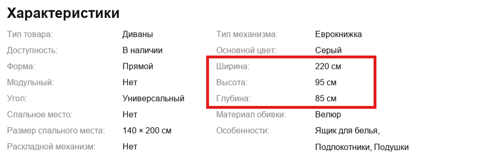

#### BUG-13: Неверное количество товара в наличии на карточке товара
- **Где обнаружено**: `item-card.png` (Под ценой)
- **Фактический результат**: `в наличии 3 шт.`.
- **Ожидаемый результат**: `в наличии 1 шт.` (в `edit-form.png` указано «Количество: 1 шт.», в `seller-card.png` — «1 шт.»).

   --------------------------------------------------------

#### BUG-14: Некорректный номер дома в адресе на карточке товара
- **Где обнаружено**: `item-card.png` (Раздел «Местоположение»)
- **Фактический результат**: `Москва, пл. Революции, 5`.
- **Ожидаемый результат**: `Москва, пл. Революции, 3` (в `edit-form.png` и `seller-card.png` указан дом 3).

---

### P2 — Средний приоритет (Medium)

#### BUG-15: Самовольная модификация текста описания товара
- **Где обнаружено**: `item-card.png` и `seller-card.png` (Раздел «Описание»)
- **Фактический результат**: К тексту описания добавлено `...с ящиком для белья, подлокотниками и подушками.`.
- **Ожидаемый результат**: Описание должно строго соответствовать введенному в `edit-form.png`: `Тестовое объявление для проверки отображения карточки и характеристик. Угловой раскладной диван.`.

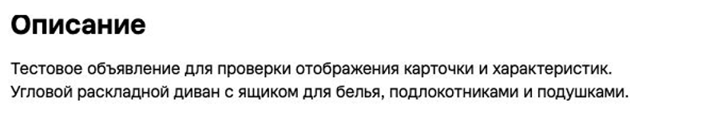

#### BUG-16: Некорректное составное значение характеристики «Особенности»
- **Где обнаружено**: `item-card.png` и `seller-card.png` (Раздел «Характеристики»)
- **Фактический результат**: `Особенности: Ящик для белья, Подлокотники, Подушки`.
- **Ожидаемый результат**: В `edit-form.png` не выбирались опции «Ящик для белья» и «Подлокотники» (в форме присутствует только «Подушки для спинки: В комплекте»). Несуществующие особенности не должны выводиться.
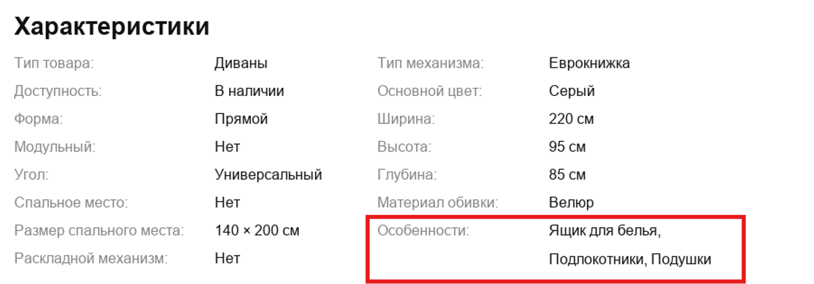

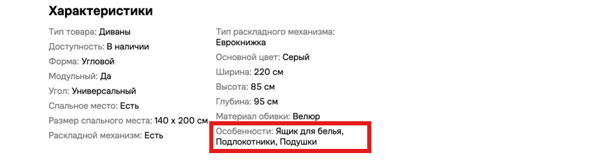

#### BUG-17: Отображение технического идентификатора акции в интерфейсе продавца
- **Где обнаружено**: `seller-card.png` (Правая колонка, блок промо-акций)
- **Фактический результат**: Выводится системный ключ `Скидки в test_sale_ops`.
- **Ожидаемый результат**: Пользователю должно выводиться человекочитаемое название маркетинговой кампании (например, «Скидки на товары»).
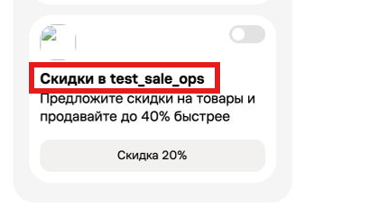

---

### P3 — Низкий приоритет (Low / Cosmetic)

#### BUG-18: Задвоение заголовка секции в форме редактирования
- **Где обнаружено**: `edit-form.png` (Верхняя часть формы)
- **Фактический результат**: Подзаголовок выводится дважды:
  `Внешний вид`
  `Внешний вид`
- **Ожидаемый результат**: Название секции «Внешний вид» должно выводиться один раз.

#### BUG-19: Битая иконка промо-акции в кабинете продавца
- **Где обнаружено**: `seller-card.png` (Блок «Скидки в test_sale_ops»)
- **Фактический результат**: Над заголовком акции отображается иконка незагрузившегося изображения `[?]`.
- **Ожидаемый результат**: Корректное отображение графической иконки акции.
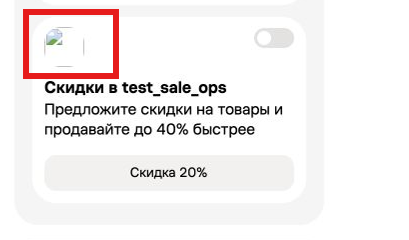

#### BUG-20: Дублирование фрагмента шапки (header) в нижней части страницы карточки товара
- **Где обнаружено**: `item-card.png` (Нижняя часть скриншота под подвалом)
- **Фактический результат**: В самом низу страницы под футтером повторно отрисована срезанная шапка сайта (`© Для бизнеса ... Avito [Поиск по объявлениям]`).
- **Ожидаемый результат**: Страница должна завершаться подвалом (footer) без фантомного дублирования шапки.
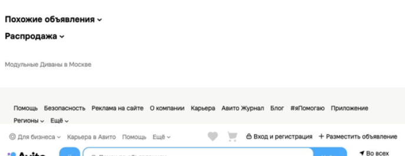

#### BUG-21: Дублирование фрагмента шапки (header) в нижней части страницы кабинета продавца
- **Где обнаружено**: `seller-card.png` (Нижняя часть скриншота)
- **Фактический результат**: В самом низу под контентом повторно отображается навигационная панель шапки.
- **Ожидаемый результат**: Корректное завершение верстки страницы без дублирования навигационных панелей.

#### BUG-22: Неконсистентность регистра слова «в наличии» в строке состояния
- **Где обнаружено**: `item-card.png` (Под ценой vs Раздел «Характеристики»)
- **Фактический результат**: Под ценой выводится `Опубликовано · в наличии 3 шт.` (со строчной буквы «в»), а в характеристиках — `Доступность: В наличии` (с заглавной «В»).
- **Ожидаемый результат**: Единый стиль регистра согласно стайл-гайду интерфейса.

